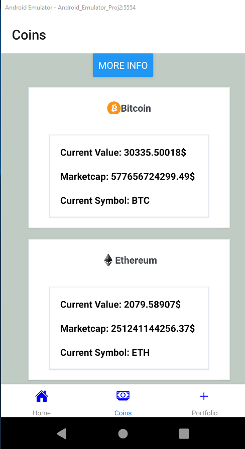
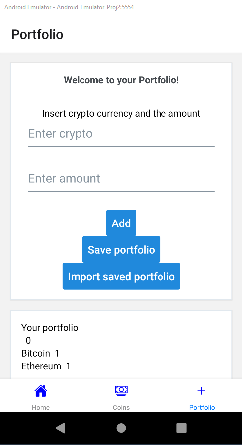

<div id="top"></div>

<!-- PROJECT LOGO -->
<br />
<div align="center">
  
<h3 align="center">Krypto Appi</h3>

<p align="center">
    Projekti luotu osana Mobiiliohjelmoinnin kurssia <br />

<br />
</p>
</div>

## Tekijä
  <p>Juho Rissanen</p>

<!-- ABOUT THE PROJECT -->
## Projektista

Tämä projekti on luotu osana Haaga-Helian mobiiliohjelmoinnin kurssia. Projektin tavoitteena oli oppia mobiiliohjelmoinnin perustoimintoja
Expo & React Native ympäristössä. Sovelluksen tarkoitus on listata kryptovaluuttoja sekä tietoa niistä. Lisäksi käyttäjä voi luoda oman portfolion ja tallentaa sen laitemuistiin

<p align="right">(<a href="#top">back to top</a>)</p>


### Teknologiat

* [React Native](https://reactnative.dev/)
* [Expo](https://expo.dev/)


<p align="right">(<a href="#top">back to top</a>)</p>


<!-- GETTING STARTED -->
## Aloitus

Jos haluat jatkokehittää / käyttää sovellusta, seuraa näitä välivaiheita

### Esitiedot


Mikäli haluat käyttää tätä sovellusta, sinulla tulee olla asennettu Expo sovellus puhelimessasi. Voit myös ajaa tätä appia selaimessa tai emulaattorilla. Laitemuistiin tallennus toimii vain laitteella / emulaattorilla

### Asennus

1. Kloonaa repo
   ```sh
   git clone https://github.com/juhkiz/Mobiiliohjelmointi.git

   ```
2. Asenna tarvittavat paketit
   ```sh
   npm install
   ```

4. Sovelluksen käynnistys terminaalissa
   ```sh
   expo start => Seuraa terminaaliin tulevia ohjeita
   ```


<p align="right">(<a href="#top">back to top</a>)</p>

## Käyttö

<p>Etusivun Home - näkymä kertoo perustietoa projektista ja appista</p>

<p>Coins välilehden näkymästä voit selata eri kryptovaluuttoja, sekä tietoa niistä</p>

<p>Painamalla More Info -> Avautuu kryptovaluuttojen lisätiedot</p>

<p>Portfolio välilehdellä voit tallettaa omia kryptovaluuttoja ja niiden määriä. Voit tämän lisäksi tallentaa nämä laitemuistiin / tuoda tallennetut valuutat laitemuistista</p>


<!-- ACKNOWLEDGMENTS -->
## Erityismainintana

Hyödyllisiä resursseja

* [React Native Elements](https://reactnativeelements.com/)


<p align="right">(<a href="#top">back to top</a>)</p>